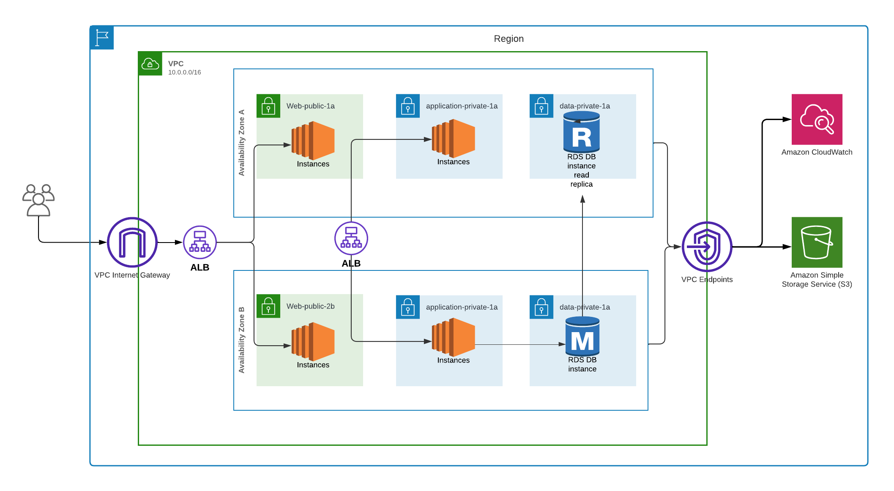

# AWS Multi-Tier Architecture with Terraform  
### Scalable, Highly Available, Modular Infrastructure with Advanced Monitoring

### Overview
This project demonstrates an AWS multi-tier architecture designed to provide scalability, high availability, and fault tolerance. The infrastructure is implemented using Terraform, showcasing modularity by splitting the architecture into reusable components such as networking, compute, database, and storage. The architecture supports two Application Load Balancers (ALBs) to manage traffic efficiently: one for public-facing users and the other for communication between the web application layer and the private application layer.

---

## Features
- Multi-Tier Architecture: Separation of concerns with distinct layers for public, application, and data tiers.
- High Availability: Resources are distributed across multiple Availability Zones (AZs).
- Scalable Web Applications: Auto-scaling instances behind ALBs for both public and private subnets.
- Relational Database: Amazon RDS with read replicas for improved performance and fault tolerance.
- Secure S3 Storage: Private S3 bucket for application storage with appropriate access controls.
- VPC Design: Custom VPC with subnets (public and private), internet gateway, and VPC endpoints for secure communication.

---

## Architecture Diagram
The architecture includes:
- VPC: Custom virtual network with subnets spanning multiple AZs.
- ALBs: Two Application Load Balancers for load distribution.
  - Public ALB for handling user traffic.
  - Private ALB for routing traffic between web and application layers.
- Compute Layer: EC2 instances in public and private subnets.
- Database Layer: Amazon RDS (MySQL) with a read replica for high availability.
- Storage Layer: Amazon S3 bucket for data storage.
- Monitoring: Integrated with Amazon CloudWatch for resource monitoring and logging.

---

## Modules
This project uses Terraform modules to simplify and organize the configuration.

### Root-Level Files
- `main.tf`: Configures and calls modules for networking, compute, database, and storage.
- `variables.tf`: Defines input variables such as VPC CIDR, database credentials, and AWS region.
- `outputs.tf`: Outputs key values like VPC ID, ALB DNS, and RDS endpoint.
- `providers.tf`: Configures the AWS provider for Terraform.

### Module-Level Code
1. Network Module: Creates VPC, public, and private subnets.
2. Compute Module: Configures EC2 instances and ALBs.
3. Database Module: Sets up Amazon RDS with subnets.
4. Storage Module: Provisions an S3 bucket.

---

## Usage

### Prerequisites
- Terraform installed on your local machine.
- AWS account with access credentials configured.
- Basic understanding of Terraform and AWS services.

